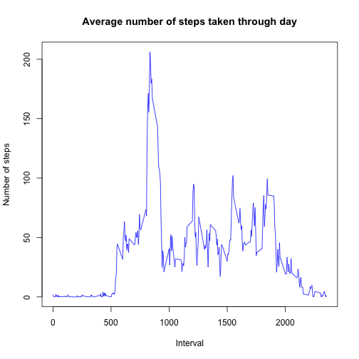

# Reproducible Research: Peer Assessment 1
This analysis is done by Alexander Makarov as a Week 2 Assignment on Reproducible Research MOOC on Coursera.
Plots shown in this report are made via *Base* and *Lattice* plotting systems. In order to go further the lattice package is needed to be sourced:

```r
library(lattice)
```

## Loading and preprocessing the data


```r
unzip("activity.zip")
activity <- read.csv("activity.csv")
```

## What is mean total number of steps taken per day?
First, we need to aggregate the data on steps taken in 5-minute intervals into daily amounts of steps taken.


```r
dailyActivity <- aggregate(steps ~ date, data = activity, sum)
```

Then, we make a histogram of the total number of steps taken each day.


```r
hist(dailyActivity$steps, main = "Histogram of total number of steps taken each day", xlab = "Number of steps", col = "blue")
```

 

Finally, we calculate and report the mean and median total number of steps taken per day.


```r
mean(dailyActivity$steps)
```

```
## [1] 10766
```

```r
median(dailyActivity$steps)
```

```
## [1] 10765
```

## What is the average daily activity pattern?

To plot and discuss the daily activity pattern we need to aggregate the data first: calculate the average number of steps in each the 5-minute interval over the given period of time and store it in the *dailyPattern* data frame.


```r
dailyPattern <- aggregate(steps ~ interval, data = activity, mean)
```

Then, we plot the daily activity pattern as a time series stored in *dailyPattern*.


```r
plot(x = dailyPattern$interval, y = dailyPattern$steps, type = "l", main = "Average number of steps taken through day", ylab = "Number of steps", xlab = "Interval", col = "blue")
```

 

Which 5-minute interval, on average across all the days in the dataset, contains the maximum number of steps?


```r
dailyPattern[dailyPattern$steps == max(dailyPattern$steps),]
```

```
##     interval steps
## 104      835 206.2
```

The 5-minute interval between 8:35 and 8:40 has the biggest number of steps taken on average across the observed time period. This finding may suggest that subjects done the most walking in the morning when being in hurry to their job / college / school etc.

## Imputing missing values

Total number of missing values in the given dataset can be calculated as follows:


```r
sum(is.na(activity$steps))
```

```
## [1] 2304
```

Let us fill in the missing values with the appropriate interval means stored in *dailyPattern* data frame (i.e. if the interval 15:00 - 15:05 has no value on a particular date, we will substitute it with the average value across all the 15:00 - 15:05 observations available in the given dataset).


```r
activityMod <- activity
for (i in 1:nrow(activityMod)) {
    if (is.na(activityMod$steps[i])) {
        activityMod$steps[i] <- dailyPattern$steps[dailyPattern$interval == activityMod$interval[i]]
    }
}
```

This transformation will help us minimize the bias of the missing values when analysing the mean and the median values of the daily number of steps.

Let us look on the new histogram and mean and median values of total number of steps taken per day.


```r
dailyActivityMod <- aggregate(steps ~ date, data = activityMod, sum)
hist(dailyActivityMod$steps, main = "Histogram of total number of steps taken each day", xlab = "Number of steps", col = "green")
```

 

```r
mean(dailyActivityMod$steps)
```

```
## [1] 10766
```

```r
median(dailyActivityMod$steps)
```

```
## [1] 10766
```

As it can be seen, this transformation of the initial dataset did not affect the distribution a lot leaving the same mean and slightly changing the median. In other terms, we substituted "missing" days with the "average" days, as shown on the histogram.

## Are there differences in activity patterns between weekdays and weekends?

First, we need to create a factor variable in *activityMod* inicating whether the particular observation was made on weekday or weekend.


```r
Sys.setlocale("LC_TIME", "en_US") #setting the commonly used english setup for dates in R (OS X command)
```

```
## [1] "en_US"
```

```r
activityMod$wd <- weekdays(as.Date(activityMod$date))
for (i in 1:nrow(activityMod)) {
    if (weekdays(as.Date(activityMod$date[i])) %in% 
                                        c("Monday","Tuesday","Wednesday","Thursday","Friday")) {
        activityMod$wd[i] <- "weekday"
    }
    else {
        activityMod$wd[i] <- "weekend"
    }
}
```

Making the panel plot of the weekday pattern and weekend pattern allows us to compare the subjects' typical behavior on weekdays and weekends.


```r
## aggregating the daily pattern with modified dataset
dailyPatternMod <- rbind(aggregate(steps ~ interval, 
                                   data = activityMod[activityMod$wd == "weekday",], mean),
                         aggregate(steps ~ interval, 
                                   data = activityMod[activityMod$wd == "weekend",], mean))
dailyPatternMod$wd[1:288] <- "weekday" #labeling weekday pattern
dailyPatternMod$wd[289:576] <- "weekend" #labeling weekend pattern
## plotting the daily patterns
xyplot(dailyPatternMod$steps ~ dailyPatternMod$interval | dailyPatternMod$wd, 
       type = "l", xlab = "Interval", ylab = "Number of steps", layout = c(1,2))
```

 

The two plotted patterns have a number of differences. In general, as it can be seen, the weekday pattern has a slightly distinguished peaks in the intervals from 08:30 to 09:30 and from 18:30 to 19:30, which may relate to subjects walking in and out of their working or studying facilities. 
